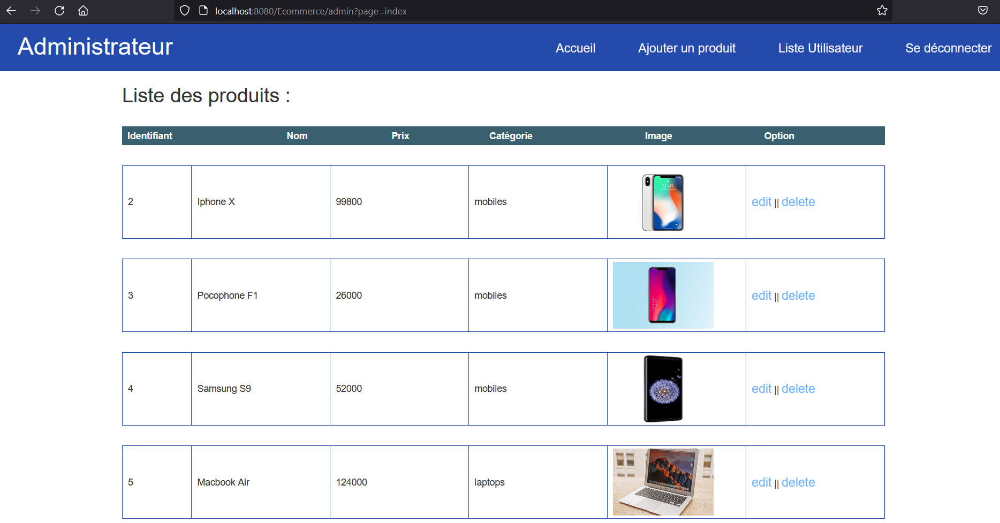
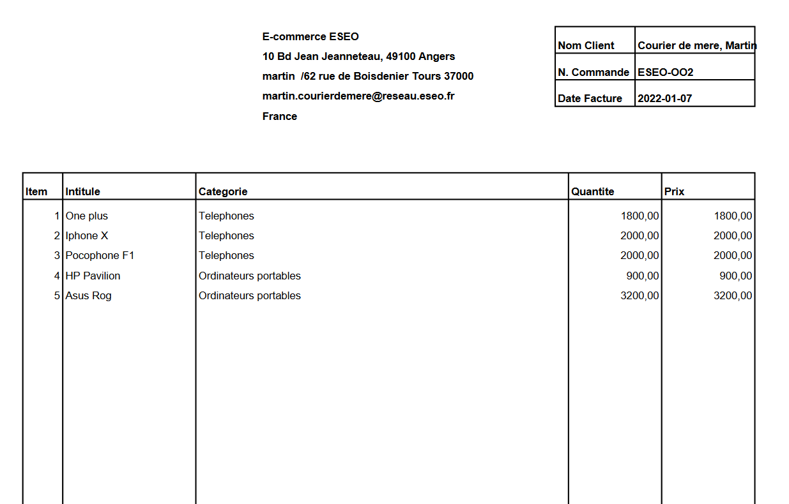

# Site JSP Ecommerce Projet ESEO A3

 

Projet devellopé durant le module JSP dans le cadre d'etude au sein de l'ESEO.
 
Le projet a été réalisé par Maxime Pouplain et Martin Courier de Méré.

## Pour commencer

### Pré-requis

Ce qu'il est requis pour commencer l'installation du projet

- Installation d'une base de donnée SQL.
- Execution du Script creation_insertion_bdd.sql.
- Création d'un Serveur Tomcat 9.0 connecté à l'Artefact du projet.
- Connexion avec les comptes ci dessous

## Compte et mot de passe 

- **Administateur**
  - **Id** : admin
  - **mdp** : admin@1234

- **Utilisateur**
  - **Id** : martin
  - **mdp** : martin

- **Utilisateur bloqué**
  - **Id** : polozed
  - **mdp** : 1234

## Consignes du projet

Vous devez développer une application de vente en ligne (version simplifiée).
 
Vous avez le choix des articles en vente, mais ils devront être chacun défini a minima par :
 
- Identifiant unique
- Nom
- Prix
- Quantité disponible (stocks du magasin)
Un client devra s’inscrire pour pouvoir commander et renseigner au minimum les
informations suivantes à son inscription :
- Nom
- Prénom
- Courriel
- Adresse de livraison

Une fois inscrit et connecté, le client pourra naviguer sur le site en ligne afin de
sélectionner des articles pour les commander. Il ne pourra valider sa commande que si
les articles sélectionnés sont bien en nombre suffisant dans le stock.
Une facture sera produite par l’application (détails des articles commandés, montant
total, …) lors d’une commande, mais vous vous affranchirez de la partie paiement.
  

Sur son espace (lorsqu’il est connecté) le client pourra visualiser l’historique de ses
commandes.
Votre application permettra aussi à un administrateur de gérer la boutique en ligne.
Lorsqu’ils seront connectés ils pourront a minima faire les actions suivantes :
- Ajouter /supprimer des nouveaux articles
- Modifier les quantités d’un article enregistré
- Bloquer un client (pas de suppression du compte, mais impossibilité pour le client
de commander

## Captures d'écran

</img>
</img>
</img>
</img>
</img>
</img>

## Génération de facture 

Utilisation de la librairie ItextPDF 

###Exemple de facture

</img>

##Chemin Utilisateur 

### Chemin Admin : 

</img>

### Chemin Client :

</img>

## Developpé avec :

* [Java 1.8](https://www.java.com/fr/) - Language de programmation
* [Hibernate](https://hibernate.org/) -  Framework de persistance des objets
* [Intellij](https://www.jetbrains.com/fr-fr/idea/) -  IDE
* [PhpMyAdmin](https://www.phpmyadmin.net/) - Application Web gestion de bdd
* [MySQL](https://www.mysql.com/fr/)) - Base de donnée SQL

## Auteurs

* **Martin Courier de Méré** _alias_ [@Polozeed](https://github.com/Polozeed/)
* **Maxime Pouplain** _alias_ [@Maxime175](https://github.com/Maxime175)

### ESEO A3 Janvier 2022

